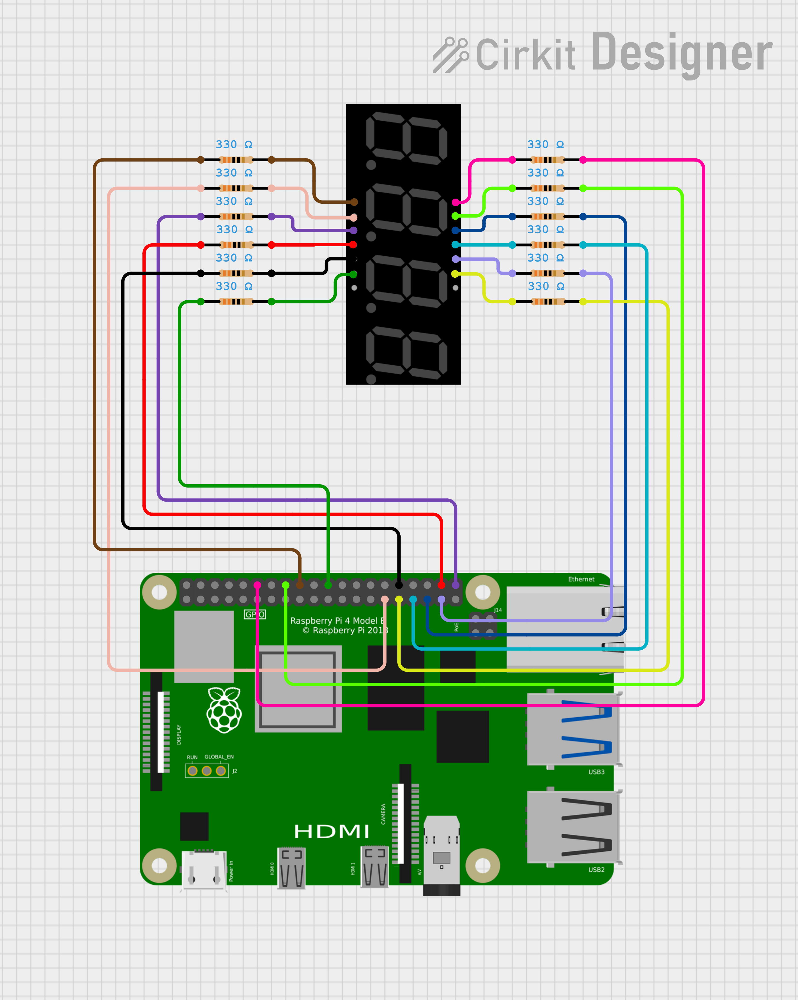

# 4 Digit 7 Segment Display Hardware Sample

This sample demonstrates how to control a 4-digit 7-segment display using the GPIO pins of a Raspberry Pi. It uses the rpi_gpio library to set up and manage GPIO outputs, allowing numbers to be displayed dynamically.

Features:
- Controls individual segments of a common-anode 7-segment display.
- Implements GPIO initialization and safe handling of digit updates.
- Uses a simple loop to cycle through numbers from 0000 to 9999 continuously.

This example provides a foundation for integrating a 7-segment display into Raspberry Pi projects, such as digital clocks, counters, or simple numerical displays.

## Pin Configuration

The GPIO pins used to control each segment and digit of the 7-segment display are defined in the code. If you are using a different display or wiring configuration, consult the display’s manual or datasheet to determine the correct pin-to-segment and digit mapping. Update the #define values accordingly to match your hardware setup.

| Segment / Function     | Raspberry Pi GPIO | Wire Colour  |
|------------------------|-------------------|--------------|
| A                      | 23                | Bright Green |
| B                      | 6                 | Yellow       |
| C                      | 20                | Red          |
| D                      | 5                 | Peach        |
| E                      | 24                | Brown        |
| F                      | 19                | Dark Blue    |
| G                      | 12                | Black        |
| DP                     | 21                | Purple       |
| Digit 1 (Common Anode) | 18                | Pink         |
| Digit 2 (Common Anode) | 13                | Teal         |
| Digit 3 (Common Anode) | 26                | Light Purple |
| Digit 4 (Common Anode) | 25                | Dark Green   |

## Schematic Diagrams

