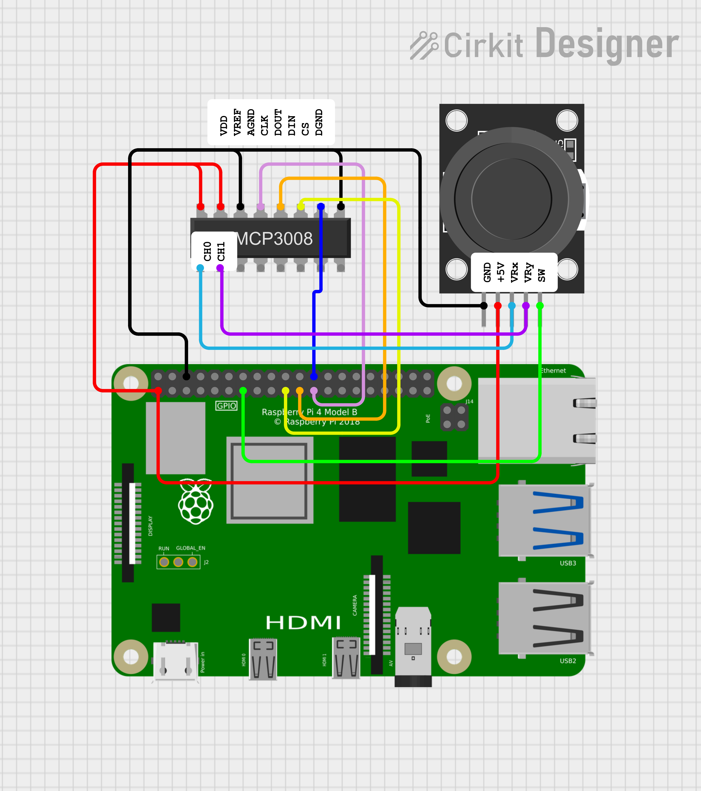

# Analog Joystick Hardware Sample

This sample demonstrates how to connect and read analog joystick input from a KY-023 module using an MCP3008 analog-to-digital converter (ADC) with a Raspberry Pi. The joystick’s horizontal (VRx) and vertical (VRy) axes are connected to the MCP3008, which converts their analog signals into digital values the Pi can read over SPI.  This setup is ideal for projects involving directional input, such as games, camera control, or robotic navigation.

The sample uses SPI (Serial Peripheral Interface) because the KY-023 joystick outputs analog signals (VRx and VRy), and the Raspberry Pi does not have built-in analog input.
* The MCP3008 is an analog-to-digital converter (ADC).
* It communicates with the Raspberry Pi using the SPI protocol.
* The analog voltages from the joystick (VRx and VRy) are converted by the MCP3008 into digital values.
* The Pi then reads those digital values via SPI.

The joystick’s button (SW) is not handled in this sample, but you can read it using a GPIO pin and detect presses with a simple digital input check.

See the [datasheet](https://cdn-shop.adafruit.com/datasheets/MCP3008.pdf) for details on the MCP3008 chip.

## Pin Configuration

MCP3008 <-> Raspberry Pi Wiring

| MCP3008 Pin | Pin Name      | Connect to Raspberry Pi       | Wire Colour                   |
|-------------|---------------|-------------------------------|-------------------------------|
| 16          | VDD           | 3.3V (e.g., Pi pin 1)         | Red                           |
| 15          | VREF          | 3.3V (same as VDD)            | Red                           |
| 14          | AGND          | GND (e.g., Pi pin 6)          | Black                         |
| 13          | CLK           | GPIO11 (SPI CLK, Pi pin 23)   | Pink                          |
| 12          | DOUT          | GPIO9 (SPI MISO, Pi pin 21)   | Orange                        |
| 11          | DIN           | GPIO10 (SPI MOSI, Pi pin 19)  | Yellow                        |
| 10          | CS            | GPIO8 (SPI CE0, Pi pin 24)    | Blue                          |
| 9           | DGND          | GND (same as AGND, Pi pin 6)  | Black                         |

KY-023 Joystick <-> MCP3008 + Pi Wiring

| KY-023 Pin | Connect To                               | Wire Colour |
|------------|------------------------------------------|-------------|
| GND        | Pi GND (e.g., pin 6)                     | Black       |
| +5V        | Pi 3.3V (pin 1 or 17)  ⚠️See note below  | Red         |
| VRx        | MCP3008 CH0 (pin 1)                      | Teal        |
| VRy        | MCP3008 CH1 (pin 2)                      | Purple      |
| SW         | Any Pi GPIO (e.g., GPIO27, pin 13)       | Green       |

⚠️ Voltage Warning

The KY-023 is typically 5V-powered, but the MCP3008 and Pi should use 3.3V to avoid logic level mismatches.

Most KY-023 modules work fine at 3.3V, but the joystick range may be a bit smaller.

If you want full 0–5V range, power the KY-023 with 5V, connect VRx/VRy through a voltage divider to bring signals down to 3.3V max.

## Schematic Diagrams

