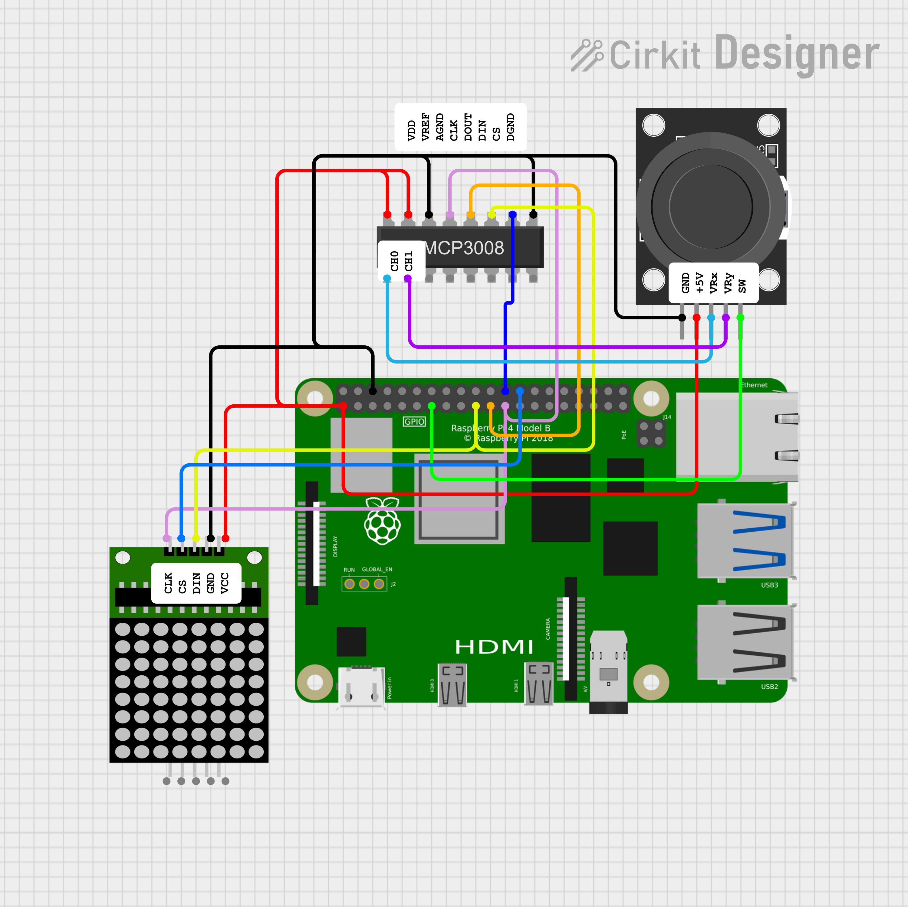

# Pixel Muncher – Joystick & LED Matrix Mini Game

Pixel Muncher is a tiny arcade-style demo where you guide a hungry pixel around an 8x8 LED matrix using a joystick. Your goal? Munch all the treats scattered across the grid! It’s a fun and hands-on way to explore joystick input and LED matrix control using SPI on QNX.

## What You’ll Experience
* Move a single LED (your “pixel”) across the 8x8 matrix using a KY-023 analog joystick.
* “Treats” appear at random positions on the matrix and are cleared when the pixel reaches them.
* The game ends when all treats have been collected – then resets so you can play again.
* The joystick button doesn’t currently do anything, but it’s ready for you to hook into future features like pause, restart, or power-ups.

## Hardware Used
* KY-023 Analog Joystick
    * VRx (horizontal) and VRy (vertical) connected to MCP3008 ADC.
    * SW (button press) connected to a Raspberry Pi GPIO pin (currently unused).
* MCP3008 ADC
    * Converts joystick’s analog signals into digital values via SPI.
* MAX7219 LED Matrix Driver
    * Controls the 8x8 LED matrix via SPI.
* Raspberry Pi running QNX
    * Reads joystick input, tracks player position, and updates the LED matrix in real time.

## How It Works

1. The joystick’s analog signals are digitized by the MCP3008 and read by the Pi over SPI.
2. Movement is smoothed and translated into directional control on the LED matrix.
3. The “treats” are displayed as static LEDs on the matrix.
4. When your pixel overlaps a treat, it’s considered “eaten” and removed.
5. After all treats are gone, the game shows a flashing X to illustrate your win, then exits.

## Features Demonstrated
* Reading analog joystick input using an MCP3008 over SPI
* Controlling an 8x8 LED matrix using the MAX7219 over SPI
* Real-time user input processing and simple game logic

## Ideas for Expansion
* Use the joystick button (Using GPIO) to restart the game, pause, or add special abilities.
* Add blinking or animated effects for the treats or winning moment.
* Introduce obstacles or timed challenges.
* Track score or time with a serial output or external display.

Enjoy your bite-sized game dev adventure!

See the [datasheet](https://cdn-shop.adafruit.com/datasheets/MCP3008.pdf) for details on the MCP3008 chip.
See the [datasheet](https://www.parallax.com/package/max7219-8-digit-display-driver-datasheet) for details on the MAX7219 chip.

## Pin Configuration

MCP3008 <-> Raspberry Pi Wiring

| MCP3008 Pin | Pin Name      | Connect to Raspberry Pi       | Wire Colour                   |
|-------------|---------------|-------------------------------|-------------------------------|
| 16          | VDD           | 3.3V (e.g., Pi pin 1)         | Red                           |
| 15          | VREF          | 3.3V (same as VDD)            | Red                           |
| 14          | AGND          | GND (e.g., Pi pin 6)          | Black                         |
| 13          | CLK           | GPIO11 (SPI CLK, Pi pin 23)   | Pink                          |
| 12          | DOUT          | GPIO9 (SPI MISO, Pi pin 21)   | Orange                        |
| 11          | DIN           | GPIO10 (SPI MOSI, Pi pin 19)  | Yellow                        |
| 10          | CS            | GPIO8 (SPI CE0, Pi pin 24)    | Blue                          |
| 9           | DGND          | GND (same as AGND, Pi pin 6)  | Black                         |

KY-023 Joystick <-> MCP3008 + Pi Wiring

| KY-023 Pin | Connect To                               | Wire Colour |
|------------|------------------------------------------|-------------|
| GND        | Pi GND (e.g., pin 6)                     | Black       |
| +5V        | Pi 3.3V (pin 1 or 17)  ⚠️See note below  | Red         |
| VRx        | MCP3008 CH0 (pin 1)                      | Teal        |
| VRy        | MCP3008 CH1 (pin 2)                      | Purple      |
| SW         | Any Pi GPIO (e.g., GPIO27, pin 13)       | Green       |

Wire the matrix as follows:

| Matrix Pin | Raspberry Pi Pin	| Pin Number      | Wire Colour | Note                       |
|------------|------------------|-----------------|-------------|----------------------------|
| VCC        | 3.3V             | Pin 1           | Red         | Power                      |
| GND        | GND              | Pin 6           | Black       | Ground                     |
| DIN        | MOSI (SPI)       | Pin 19 (GPIO10) | Yellow      | Data In                    |
| CS         | CE0 (SPI)        | Pin 26 (GPIO7)  | Light Blue  | Chip Select                |
| CLK        | SCLK (SPI)       | Pin 23 (GPIO11) | Pink        | Clock                      |

⚠️ Voltage Warning

The KY-023 is typically 5V-powered, but the MCP3008 and Pi should use 3.3V to avoid logic level mismatches.

Most KY-023 modules work fine at 3.3V, but the joystick range may be a bit smaller.

If you want full 0–5V range, power the KY-023 with 5V, connect VRx/VRy through a voltage divider to bring signals down to 3.3V max.

## Schematic Diagrams

