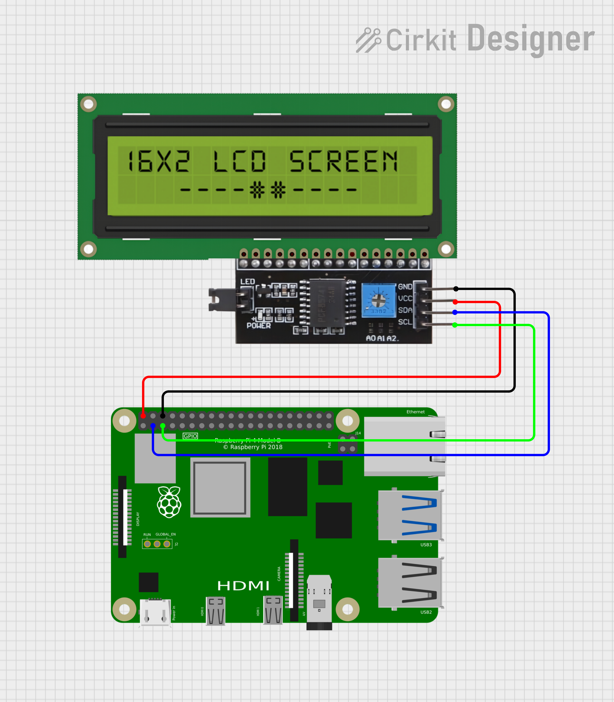

# I2C LCD1602 Display Hardware Sample

This project demonstrates how to control a 1602 LCD display (with I2C backpack) on a Raspberry Pi. 

It includes display initialization, writing text, and a smooth marquee effect.

## 1602 LCD + PCF8574 I2C Module

This project uses a 1602 character LCD display (16 characters x 2 lines) for output, paired with a PCF8574 I/O expander to simplify wiring.

The 1602 LCD normally requires 6+ GPIO pins to operate. To reduce pin usage, it's connected via a PCF8574 I2C backpack, allowing control over just two I2C lines (SDA & SCL). This setup is ideal for microcontrollers with limited GPIO or when you want a cleaner wiring layout.

## Hardware Requirements

- Raspberry Pi 4
- 1602 character LCD display
- PCF8574 I2C I/O expander (usually included as an "I2C backpack" on the LCD)
- I2C jumper wires (4-pin: GND, VCC, SDA, SCL)

## Pin Configuration

| LCD Pin | Raspberry Pi Pin | Wire Colour |
|---------|------------------|-------------|
| GND     | GND              | Black       |
| VCC     | 5V               | Red         |
| SDA     | GPIO 2 (Pin 3)   | Blue        |
| SCL     | GPIO 3 (Pin 5)   | Green       |

## Schematic Diagrams

