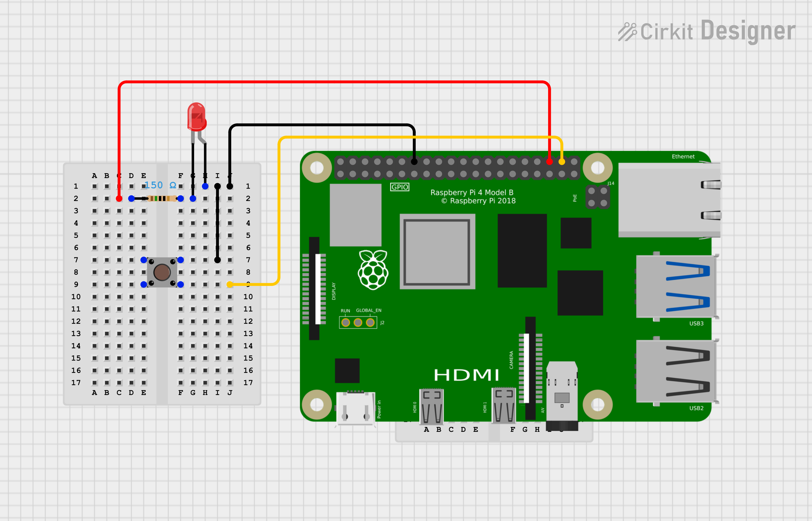

# LED Pushbutton Hardware Sample

This demo shows how to turn on and off an LED using a pushbutton on a Raspberry Pi using QNX.

When the button is pressed down the LED turns on and when the button is released the LED turns off.

## Pin Configuration

Wire the LED as follows:
- Red wire to GPIO 16 (pin 36)
- Black wire to pin 14 (Ground)

Wire the pushbutton as follows:
- Yellow wire to GPIO 20 (pin 38)
- Black wire to pin 14 (Ground)

## Schematic Diagrams

