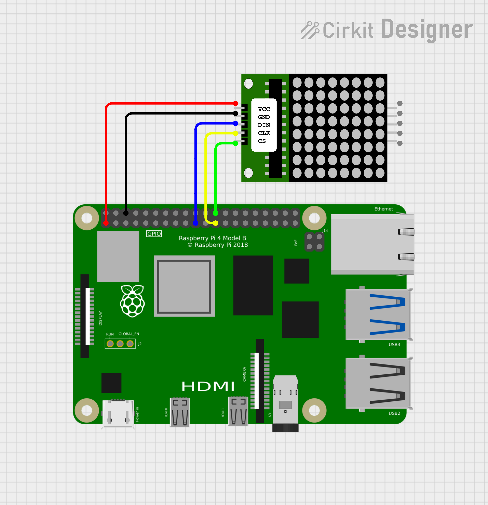

# 8x8 LED Matrix Sample

This sample initializes and controls an 8x8 LED matrix using the MAX7219 display driver over SPI using QNX. 

It configures the device, sets brightness, clears the display, and then lights up each row in sequence to demonstrate basic functionality.

See the [datasheet](https://www.parallax.com/package/max7219-8-digit-display-driver-datasheet) for details on the MAX7219 chip.

## Pin Configuration

Wire the matrix as follows:

| Matrix Pin | Raspberry Pi Pin	| Pin Number      | Wire Colour | Note                       |
|------------|------------------|-----------------|-------------|----------------------------|
| VCC        | 3.3V or 5V       | Pin 1 or 2      | Red         | Use 5V for full brightness |
| GND        | GND              | Pin 6           | Black       | Ground                     |
| DIN        | MOSI (SPI)       | Pin 19 (GPIO10) | Blue        | Data In                    |
| CS         | CE0 (SPI)        | Pin 24 (GPIO8)  | Green       | Chip Select                |
| CLK        | SCLK (SPI)       | Pin 23 (GPIO11) | Yellow      | Clock                      |

## Schematic Diagrams

