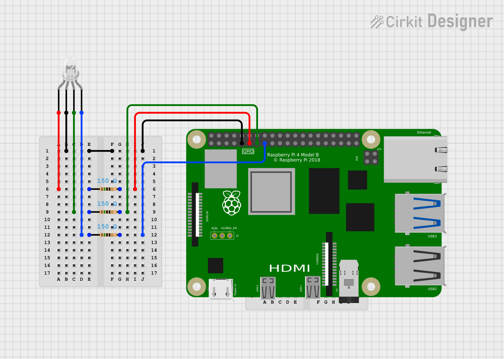

# 4-Wire RGB LED Sample

This sample shows how to change between multiple colours on an RGB LED on a Raspberry Pi using QNX.

## Pin Configuration

Wire the LED according to one of th following schematic diagrams and connect to the Raspberry Pi.

Using a 4 wire RGB LED
- Black wire to pin 9 (Ground)
- Red wire to GPIO 17 (pin 11)
- Green wire to GPIO 27 (pin 13)
- Blue wire to GPIO 22 (pin 15)

Note: You can also purchase an LED that has built in resistors and then just connect that directly to the Raspberry Pi without needed a breadboard and extra wires.

## Schematic Diagrams

