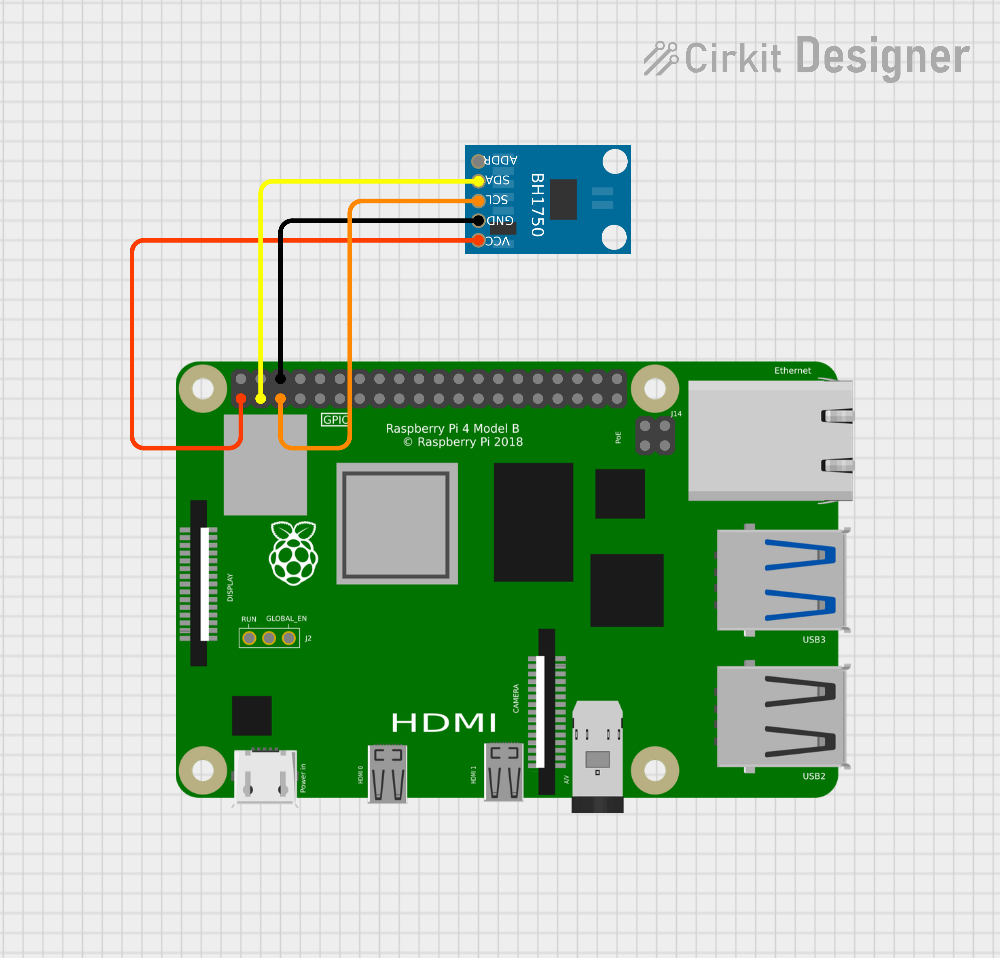

# I2C Light Sensor Hardware Sample

This sample demonstrates how to read light level data (in lux) from an I2C-connected BH1750 light sensor using a Raspberry Pi on QNX. 

The sensor continuously reports lux values to the console.

## Features
- Initializes the sensor in continuous high-resolution mode
- Reads 2-byte lux data over I2C
- Converts raw data to lux
- Prints lux values to the console at a 200ms interval

## Pin Configuration

| BH1750 Pin | Connect To                               | Wire Colour |
|------------|------------------------------------------|-------------|
| +3.3V      | Pi 3.3V (pin 1)                          | Red         |
| GND        | Pi GND (e.g., pin 6)                     | Black       |
| SDA        | GPIO 2 (pin 3)                           | Yellow      |
| SCL        | GPIO 3 (pin 5)                           | Orange      |

## Schematic Diagrams

