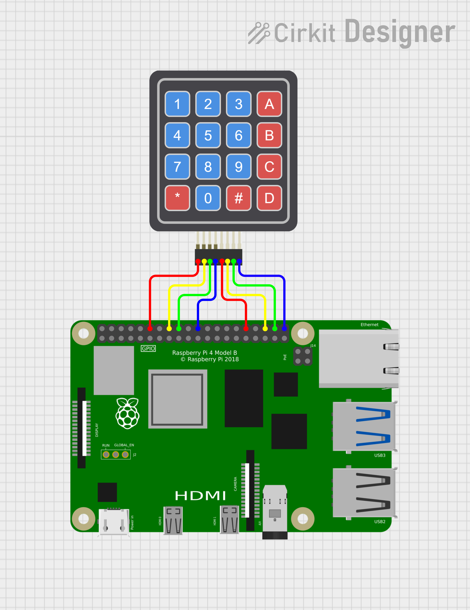

# 4x4 Numeric Keypad QNX Hardware Sample

This project demonstrates how to interface a 4x4 matrix keypad with a Raspberry Pi using GPIO pins. 

A 4x4 numeric keypad consists of 16 keys arranged in a matrix of 4 rows and 4 columns. It typically has 8 pins, which correspond to these rows and columns.

The row pins are connected to each horizontal set of keys, while the column pins are connected to each vertical set. When a key is pressed, it completes a circuit between a specific row and column, allowing a microcontroller to detect the keypress by scanning the matrix.

The program continuously scans for key presses and prints the detected key to the console.

## How It Works

### GPIO Setup

- The row pins (18, 23, 24, 25) are configured as outputs and initialized to HIGH.
- The column pins (12, 16, 20, 21) are set as inputs with pull-up resistors enabled.

### Keypad Scanning

- The program iterates through each row, setting it LOW while keeping others HIGH.
- It then checks each column for a LOW signal, indicating a key press.
- If a key press is detected, it waits for release (debounce) and returns the corresponding character from the keypad layout.

### Main Loop

- The main function initializes the GPIO and starts scanning for key presses.
- When a key is pressed, it prints the key character and waits 200ms before scanning again.

## Pin Configuration

4x4 keypads typically have 8 pins: 4 for the rows and 4 for the columns.

- Red wire (row 1) to GPIO 18 (pin 12)
- Yellow wire (row 2) to GPIO 23 (pin 16)
- Green wire (row 3) to GPIO 24 (pin 18)
- Blue wire (row 4) to GPIO 25 (pin 22)

- Red wire (column 1) to GPIO 12 (pin 32)
- Yellow wire (column 2) to GPIO 16 (pin 36)
- Green wire (column 3) to GPIO 20 (pin 38)
- Blue wire (rcolumnow 4) to GPIO 21 (pin 40)

## Schematic Diagram

