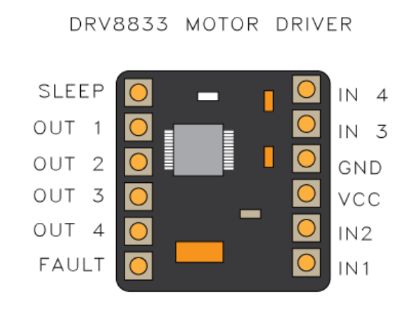
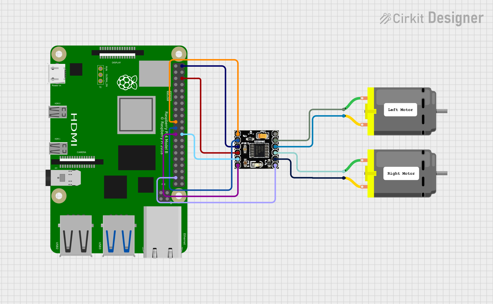

# DRV8833 Motor Controller for QNX
 
This repository contains sample code (in both C and Python) for controlling DC motors using the DRV8833PWP dual motor controller on QNX. Originally written for the Trilobot platform, this code can also be adapted for use on a breadboard or other hardware setups.
 
> **Important:**  
> The motor enable (EN) pin MUST be configured for PWM output. Without proper PWM
  configuration, the motor speed will not vary because the enable pin will not modulate
  the power supplied to the motors.

 
## Table of Contents
 
- [Overview](#overview)
- [Hardware Setup](#hardware-setup)
  - [Trilobot Setup](#trilobot-setup)
  - [Breadboard/Other Platforms](#breadboardother-platforms)
- [Schematic](#schematic)
- [Software Requirements](#software-requirements)
- [Build the Code](#build-the-code)
 
## Overview
 
The DRV8833 motor controller sample demonstrates how to drive two DC motors using a standard dual motor controller. The code controls motor speed via a PWM signal on the enable (Sleep) pin and sets the motor direction using digital GPIO outputs. The sample supports forward, reverse, and pivot turns (left and right).
 
## Hardware Setup
 
### Trilobot Setup
 
For the Trilobot platform, the motor controller is wired as follows:
 
- **Sleep/Enable:**  
  The enable (Sleep) pin of the DRV8833 is connected to a PWM-capable GPIO. In this sample, it is configured on **GPIO 18**.
  
- **Right Motor:**  
  - **Forward (AIN1):** Connected to **GPIO 10**  
  - **Reverse (AIN2):** Connected to **GPIO 9**
  
- **Left Motor:**  
  - **Forward (BIN1):** Connected to **GPIO 8**  
  - **Reverse (BIN2):** Connected to **GPIO 11**  
 
### Breadboard / Other Platforms
 
When using the motor controller on a breadboard or another platform:
 
- **Power Supply:**  
  Ensure the controller receives a stable voltage and is properly grounded.
  
- **Connections:**  
  - Connect the enable (Sleep) pin to a PWM-capable GPIO.
  - Connect the motor direction inputs to available digital GPIOs.
  
- **GPIO Pin Configuration:**  
  Adjust the pin configuration in the code to match your hardware setup.
 
## Schematic
 
A schematic diagram of the motor controller wiring is available in the `images/` folder. Use the following images as a reference:
 
- **Controller Diagram:**  
  
 
- **Circuit Diagram:**  
  
 
## Software Requirements
 
- **QNX Operating System 8.0**
- **rpi_gpio API:**  
  The GPIO client API (e.g., `rpi_gpio.h`) is provided in the `common/` folder.
 
## Build the Code

From the `motor-controller/c/` directory, run: `make`

