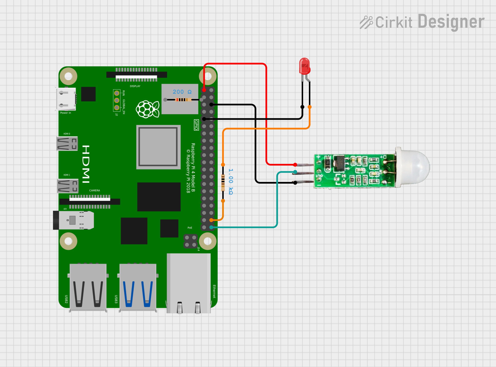

# PIR Sensor Sample
This sample code demontrates how to interact with a PIR sensor. A PIR (Passive Infared) sensor detects the levels of infared light in its field of view. Using the differences in IR light these sensors detect general movements. 

This code uses the `hc-sr501` sensor, but other PIR sensors should operate the same. The sensor, like every other sensor, has a voltage and ground pin which needs a 3.3 V and ground connection. It also has an output pin which is connected to the pin `GPIO 21`. The sensor will send a positive voltage through its output pin if motion is detected. An LED is connected to the pin `GPIO 20` to give visual feedback on motion detection.

# Circuit Schematic

