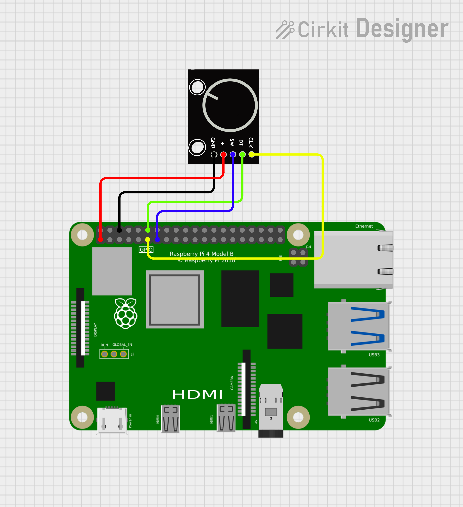

# Rotary Encoder Hardware Sample

This sample shows how to read values from a rotary encoder and detect button presses on a Raspberry Pi using QNX.

When the rotary encoder is turned, the value increases or decreases depending on the direction. When the button is pressed, it will print "Button Pressed".

## Pin Configuration

Wire the rotary encoder as follows:

- Red wire to 3.3V (pin 1)
- Black wire to Ground (pin 6)
- Yellow wire to GPIO 17 (pin 11) for CLK
- Green wire to GPIO 18 (pin 12) for DT
- Blue wire to GPIO 27 (pin 13) for the push-button (SW)

## Schematic Diagrams

