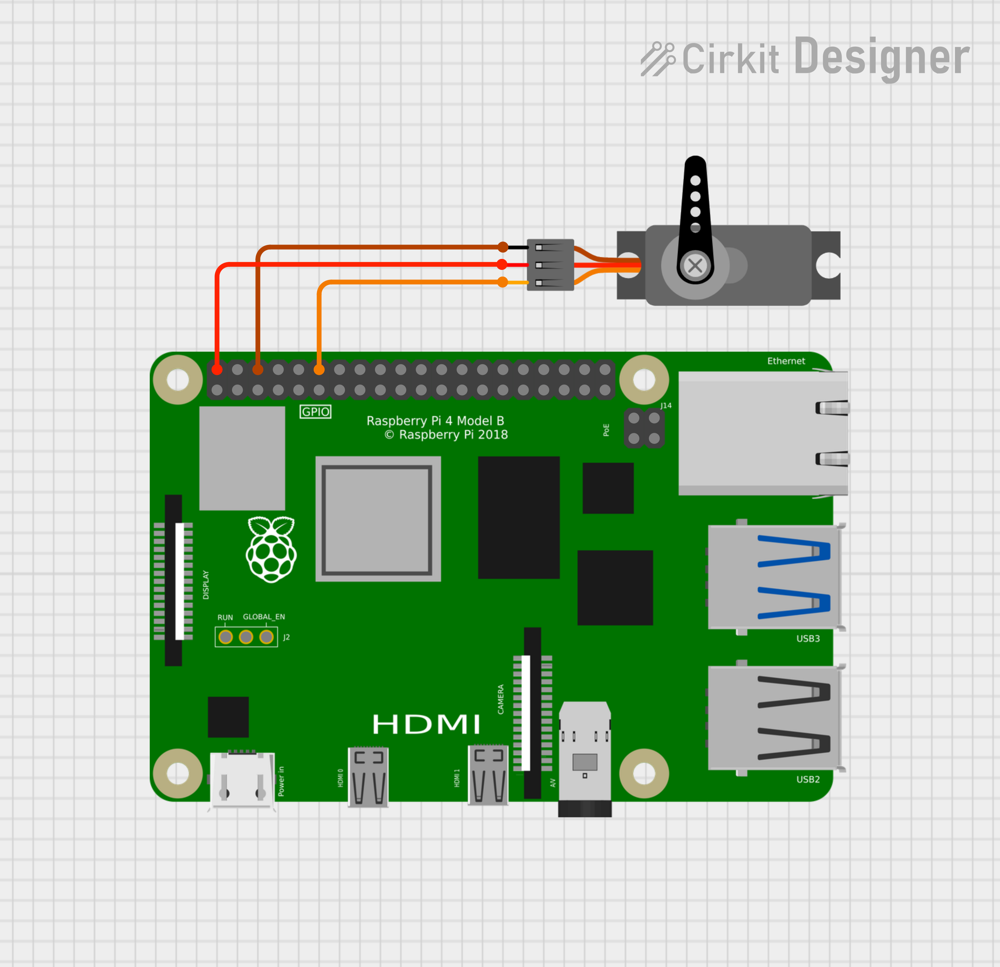

# Micro Servo QNX Hardware Sample

This demo shows how to use PWM to control a servo motor. A servo is an electric motor that has a control mechanism that allows for exact positioning of the shaft. The angle of the shaft is communicated to the motor via PWM, where the period is fixed and the duty cycle is used to determine the angle.

There are many different types of servo motors, but one of the most common for beginners is the SG90, which is marketed under different brand names. This is an inexpensive, albeit weak, servo, but will do for the purpose of this exercise. The shaft can only be rotated 180 degrees between a minimum position and a maximum position.

More information on PMW can be found in the PMW section of the "Introduction to QNX RTOS with Raspberry Pi" book found [here](https://elahav.gitlab.io/qnx-rpi-book/python.html#sec:pwm)

These samples illustrate moving the shaft from 0 to 180 degrees in small steps and then back again.

## Pin Configuration

The servo has three wires: brown/black (ground), red (power) and orange/yellow (control)

- Red wire to pin 2 (5V)
- Brown/Black wire to pin 6 (Ground)
- Orange/Yellow wire into GPIO 18 (pin 12)

## Schematic Diagram

