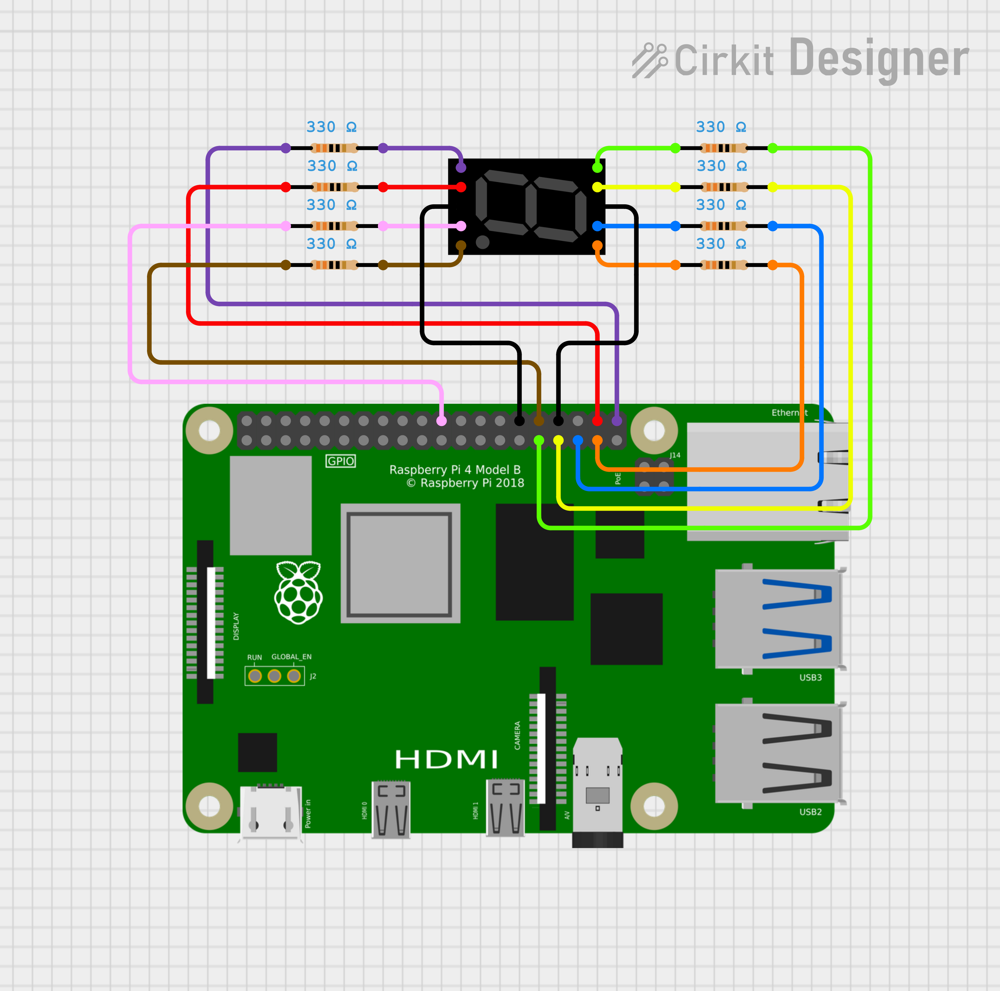

# 7 Segment Display Hardware Sample

This demo shows how to control a 7-segment display (like the 5011AS) with a Raspberry Pi 4. Using GPIO pins, you can display numbers and characters on the 7-segment display. This project is ideal for learning about digital outputs, GPIO control, and interfacing hardware with a Raspberry Pi.

## Pin Configuration

| Segment | 7-Segment Pin | Raspberry Pi GPIO |Wire Colour |
|---------|---------------|-------------------|------------|
| A       | Pin 7         | GPIO19            |Blue        |
| B       | Pin 6         | GPIO26            |Orange      |
| C       | Pin 4         | GPIO25            |Pink        |
| D       | Pin 2         | GPIO20            |Red         |
| E       | Pin 1         | GPIO21            |Purple      |
| F       | Pin 9         | GPIO13            |Yellow      |
| G       | Pin 10        | GPIO6             |Green       |
| DP      | Pin 5         | GPIO12            |Brown       |
| Common  | Pin 3,8       | GND               |Black       |

## Schematic Diagrams

