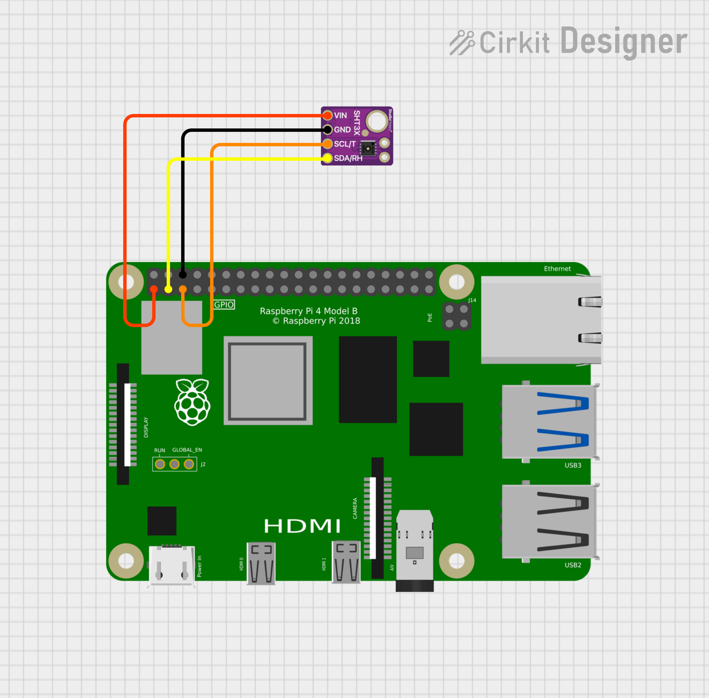

# I2C Temperature Humidity Hardware Sample

This sample demonstrates how to read temperature and humidity from an I2C-connected SHT3X sensor using a Raspberry Pi on QNX. 

The sample continuously reports temperature and humidity values to the console.

## Pin Configuration

| SHT3X Pin  | Connect To                               | Wire Colour |
|------------|------------------------------------------|-------------|
| +3.3V      | Pi 3.3V (pin 1)                          | Red         |
| GND        | Pi GND (e.g., pin 6)                     | Black       |
| SDA        | GPIO 2 (pin 3)                           | Yellow      |
| SCL        | GPIO 3 (pin 5)                           | Orange      |

## Schematic Diagrams

